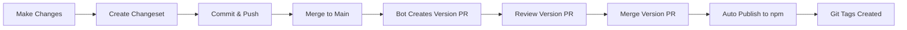

# Release Process

This project uses [Changesets](https://github.com/changesets/changesets) for version management and publishing.

## Prerequisites

1. **NPM Account**: Create an account at [npmjs.com](https://www.npmjs.com/)
2. **NPM Token**: Generate an access token with publish permissions
3. **GitHub Secret**: Add `NPM_TOKEN` to repository secrets at `Settings > Secrets and variables > Actions`

## Creating a Release

### 1. Create a Changeset

When you make changes that should be released, create a changeset:

```bash
pnpm changeset
```

This will prompt you to:
- Select which packages have changed
- Select the bump type (major, minor, patch)
- Write a summary of the changes

The changeset will be saved in `.changeset/` directory.

### 2. Commit and Push

```bash
git add .changeset
git commit -m "chore: add changeset for feature X"
git push
```

### 3. Merge to Main

When you merge to `main` branch, the GitHub Actions workflow will:

1. **Create a Version PR**: A bot will create a "Release" PR that:
   - Updates package versions based on changesets
   - Updates CHANGELOG.md
   - Removes consumed changeset files

2. **Publish on Merge**: When you merge the "Release" PR:
   - Packages are built
   - Packages are published to npm
   - Git tags are created

## Manual Release (Local)

If you need to release manually:

```bash
# 1. Update versions
pnpm changeset version

# 2. Build and publish
pnpm release
```

**Note**: You need to be logged in to npm (`npm login`) and have publish permissions.

## Release Workflow



## Version Bumps

- **Patch** (0.0.X): Bug fixes, minor updates
- **Minor** (0.X.0): New features, backwards compatible
- **Major** (X.0.0): Breaking changes

## Current Release: 0.0.1

The initial release includes:
- SRT to FCPXML conversion
- Multi-line subtitle support
- Unicode support
- Customizable styling
- Config file support
- CLI and library
- Tested with Final Cut Pro 11.2
